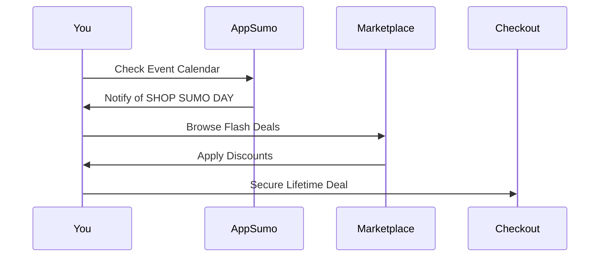

## Overview

AppSumo empowers you to discover and acquire top-tier business software at unbeatable prices. As a marketplace for entrepreneurs, it curates deals across productivity, marketing, and content categories, all featuring a one-time payment model that eliminates recurring fees. Special events and robust community support further enhance your experience.

<Columns cols={3}>
  <Card title="Deal Discovery" icon="search" href="#deal-discovery">
    Easily find tools tailored to your business needs through intuitive browsing and personalized recommendations.
  </Card>
  <Card title="Lifetime Deals" icon="gift" href="#one-time-purchases">
    Secure lifetime access to premium software with a single payment.
  </Card>
  <Card title="Events & Community" icon="users" href="#events">
    Participate in exclusive events and tap into a vibrant entrepreneur network.
  </Card>
</Columns>

## Deal Discovery and Categories

Navigate AppSumo's marketplace to uncover deals organized into key categories. You browse productivity enhancers like task managers, marketing automation tools, and content creation suites such as video editors or AI writers.

<Tabs>
  <Tab title="Productivity" icon="clock">
    Boost efficiency with tools for automation and workflow optimization.

    - Task automation platforms
    - Time-tracking apps
    - Collaboration software
  </Tab>
  <Tab title="Marketing" icon="trending-up">
    Drive growth using email, SEO, and ad management solutions.

    | Tool Type     | Example Use Case                  |
    |---------------|-----------------------------------|
    | Email Builders| Create targeted campaigns         |
    | SEO Analyzers | Optimize site rankings            |
    | Ad Trackers   | Monitor performance metrics       |
  </Tab>
  <Tab title="Content" icon="edit-3">
    Produce high-quality assets effortlessly.

    - Graphic design tools
    - Video editing suites
    - AI content generators
  </Tab>
</Tabs>

<Callout kind="tip">
  Use filters like `{price < $50}` or `{rating > 4.5}` to refine your search quickly.
</Callout>

## One-Time Purchase Model

AppSumo revolutionizes software acquisition by offering lifetime deals—no subscriptions required. You pay once and gain perpetual access, saving thousands compared to monthly SaaS fees.

<Steps>
  <Step title="Browse Deals" icon="search">
    Visit the marketplace and select a tool from curated listings.
  </Step>
  <Step title="Review Details" icon="file-text">
    Check features, reviews, and refund policies.
  </Step>
  <Step title="Purchase" icon="shopping-cart">
    Add to cart and complete checkout with one-time payment.
  </Step>
  <Step title="Access Instantly" icon="check-circle">
    Receive login credentials or download links immediately.
  </Step>
</Steps>

## Special Events like SHOP SUMO DAY

AppSumo hosts flash sales and events such as SHOP SUMO DAY, where you snag extra discounts on popular tools. These limited-time opportunities feature time-sensitive deals and exclusive bundles.

Stay updated via email newsletters or the dashboard at `https://appsumo.com/events`.

## Customer Support and Community Resources

Access comprehensive support through multiple channels. AppSumo provides ticket-based help, extensive FAQs, and a thriving community forum.

<ExpandableGroup>
  <Expandable title="Getting Help with Purchases" default-open="true">
    Submit a ticket via the support portal. Expect responses within 24 hours. Common issues include license activation and refunds (90-day guarantee).
  </Expandable>
  <Expandable title="Join the Community">
    Engage on the AppSumo forum, Reddit, or Facebook groups. Share reviews and tips with fellow entrepreneurs.
  </Expandable>
  <Expandable title="Educational Resources">
    Watch tutorials and webinars on tool integration. Access free guides for maximizing deal value.
  </Expandable>
</ExpandableGroup>

<Callout kind="success">
  Over 1 million users trust AppSumo—join the community to accelerate your business today.
</Callout>